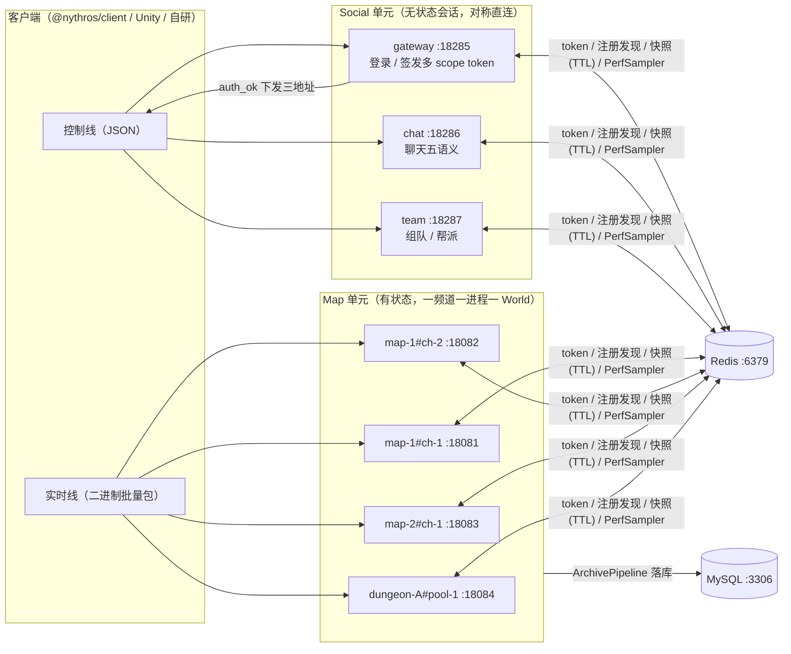
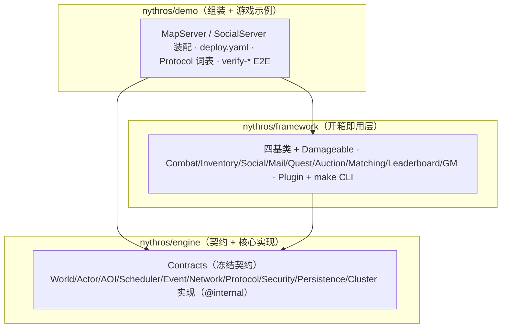
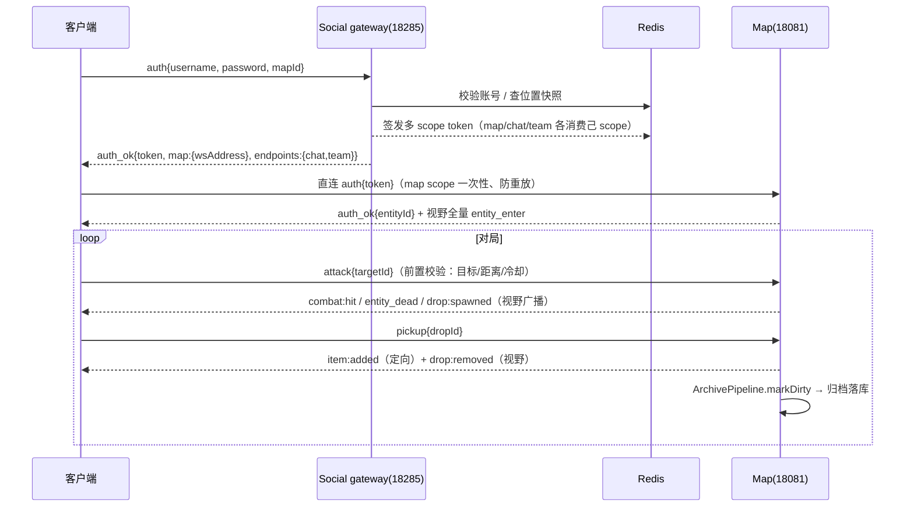

# Nythros 架构（Architecture）

> 本文描述 Nythros 引擎的分层结构、服务拓扑与依赖铁律。设计依据：`blueprint/01-架构规范.md`、ADR-020（三层产品定位与结构重划）、ADR-021（移除 gateway-worker 统一自研网关栈）、ADR-018/019（阶段 6 发布形态）。

## 1. 三层结构

```text
Demo（组装 + 游戏示例）
  └─ nythros/demo：deploy.yaml 拓扑、SocialServer 社交装配、MapServer、Protocol、怪物/掉落示例

Framework（三基类 + 业务模块 + 插件 + 脚手架）
  └─ nythros/framework：BasePlayer/BaseMonster/BaseNPC（继承 engine 的 Actor\BaseActor）+ Damageable + Combat/Inventory/Social/Actor/Auth 模块 + Plugin + make CLI

Engine（契约 + 核心实现）
  └─ nythros/engine：Contracts 接口 + 内核/世界/实体/Actor/AOI/事件/网络/协议/安全/持久化/集群实现
```

### 1.1 Engine：接口 + 实现

- **Contracts**（`Nythros\Contracts`）：引擎只暴露接口，跨层通信一律走接口。v0.1 冻结的契约包括 `ClockInterface`、`SchedulerInterface`、`WorldInterface`、`EntityInterface`、`ActorInterface`、`EntityManagerInterface`、`ActorSystemInterface`、`AOIProviderInterface`、`EventBusInterface`、`EventEnvelope`、`TimerInterface`。
- **核心实现**：`World`（运行时聚合根，驱动 Actor → AOI → 调度器）、`GridAOI`（空间索引）、`SimpleEntityManager` / `SimpleActorSystem` / `SimpleEventBus`、`SystemClock` / `SimpleScheduler` / `RegionScheduler`、`BaseEntity` / `Position`、`BaseActor`，以及网络（`WorkermanWebSocketServer`）、协议（`JsonSerializer` / `BinaryBatchSerializer` 二进制批量 + `ProtocolVocabulary` 枚举压缩词表，Map 频道走二进制、社交层走 JSON，见 `docs/protocol.md`）、安全（`RedisTokenStore` / `TokenManager`）、持久化（`InMemoryStorage`）、集群（`RedisServiceRegistry`）等实现。
- **实现细节标记 `@internal`**：具体实现类不构成 API 承诺，业务层只依赖 Contracts 接口。

### 1.2 Framework：开箱即用层

- Actor 基座在 engine：`BaseActor`（绑实体 + 抽象 update）；framework 在其上给三个基类：
  `BasePlayer`（连接/uid/血量 + 钩子）、`BaseMonster`（AI 状态机 + 钩子）、`BaseNPC`（静态实体 + 交互）。
- 战斗契约 `Damageable`：玩家与怪物共同实现的最小战斗面（hp / maxHp / takeDamage / heal / isDead），使战斗服务以统一签名承载双向攻击。
- 业务模块（ADR-020 §3.1 上移）：`Combat`（CombatService/MonsterActor/掉落）、`Inventory`、`Social`（SocialService/ConnectionHub/TeamStore/GuildStore/LocationStore）、`Actor`（PlayerActor）、`Auth`（Identity）。
- 插件机制 `Nythros\Framework\Plugin`：官方插件（Skill / Item / Buff）经 `PluginRegistry::load` 走 register → enable 生命周期，数据定义经 Container 注入。
- 脚手架 `make` CLI：`make:actor` / `make:skill` / `make:event` / `make:map`（入口 `vendor/bin/make`）。

### 1.3 Demo：组装与示例

- 拓扑事实源：`packages/demo/config/deploy.yaml`（描述全部部署单元：social 三角色 + 地图/副本频道，ADR-021 自研单栈）。
- 组装脚本：`bin/server`（根编排壳，读 deploy.yaml 分组 spawn）→ 社交组逐角色 spawn `run-worker.php --service=<type>`、地图组 spawn `bin/start-maps.php`；`launch.php` 保留为只起地图的便捷入口。
- 游戏示例：`MapServer`（认证/移动/视野广播入口）、`SocialServer`（社交三角色共用装配壳）、`StaticAuthenticator`（演示账号占位）、`Protocol/*`（演示自有协议词表）；战斗闭环与社交业务逻辑已上移 framework（见 1.2）。

## 2. 服务拓扑

### 2.0 拓扑图



### 2.0.1 分层结构图



### 2.0.2 连接拓扑（文字版）

```text
客户端 ── 社交连接(18285/18286/18287) ──> Social 单元（自研单栈，对称直连，ADR-021）
  │        ├─ gateway(18285)：登录入口，auth_ok 下发 map/chat/team 三地址
  │        ├─ chat(18286) / team(18287)：聊天五语义、组队、帮派
  │        └─ 三角色共用 SocialServer 类，连接表进程内独立
  │
  ├─ 战斗连接(18081~18084) ──> Map 单元（自研，有状态，一频道一进程一 World，客户端直连）
  │
  └─ 协调：Redis(6379)（token 多 scope / 服务注册与发现 / 组队·位置·帮派快照 TTL）
```

### 2.1 两条通信线路

- **控制线**：Client → Social 单元（gateway/chat/team 对称直连）。承载登录、鉴权、聊天、组队、帮派、全局通知。
- **实时数据线**：Client → Token → Map Server。承载移动、战斗、技能、AOI 广播、高频状态同步。

铁律：**战斗帧同步必须客户端直连 Map，不经社交层转发**（对称直连，避免高频多一跳开销，ADR-013/ADR-021）。

### 2.2 服务角色

| 角色 | 进程 | 状态特征 | 职责 |
|---|---|---|---|
| Social gateway | 自研 run-worker | 在线会话（进程内连接表） | 登录签发、bindUid/joinGroup、auth_ok 下发三地址 |
| Social chat/team | 自研 run-worker | 在线会话（进程内连接表） | 聊天五语义、组队状态机、帮派 |
| Map | 自研 run-worker / start-maps | 帧级（战斗状态） | AOI/位置/血量、掉落 |
| Redis | 外部 | 持久 + TTL | token 多 scope、服务注册表、队伍/位置快照 |

### 2.3 数据边界

| 状态层 | 落点 | 生命周期 |
|---|---|---|
| 持久状态 | Redis/DB | 永久（账号/角色/货币） |
| 临时共享状态 | Redis（TTL） | 掉线超时（组队/token/掉线标记） |
| 分组状态 | Social 连接表 | 在线会话（谁在哪个分组，进程内，onClose 自动清除） |
| 战斗状态 | Map | 帧级（AOI/位置/血量，进程内） |

判定口诀：「要保留」→ 永久进 DB/Redis、临时带 TTL 进 Redis；「要跨在线共享」→ 分组进 Social 连接表；「帧级高频」→ Map。

### 2.4 启动顺序与部署

- 启动铁序（ADR-021 §3.3）：**Redis（外部）→ social 单元 → map 单元**。`php bin/server start` 一条命令完成（`--parts=social|maps` 可单独部署一个单元）。
- 部署单元：`deploy.yaml` 中每个 `process` 块 = 一个部署单元；`social` 块声明 gateway/chat/team 三角色，每个 `map` 服务声明 `mapId + channelId`（serviceId 编码 `{mapId}#{channelId}`，一频道一进程一 World），`count` 字段可展开多个 worker。
- Map 有状态不能 reload，采用「滚动更新」：新实例 serving → 旧实例在 Redis 标记 stopping → 社交层 discover 过滤不再分配新玩家 → 旧实例自然退出。

## 3. 依赖方向铁律

```text
允许：
  Framework → Engine          （framework 依赖 engine 的 contracts + actor）
  Demo      → Framework       （demo 依赖 framework 基类）
  Demo      → Engine          （demo 依赖 engine 接口与实现）

禁止：
  Engine → Framework          （引擎不知道框架层存在）
  Engine → Demo
  Cell   → 业务模块（RPG/Skill/Inventory）
```

具体到代码：Demo 的业务类（如 `MonsterActor`）只依赖 `Nythros\Contracts` 接口 + `Nythros\Framework` 基类 + demo 自建接口，绝不 import 引擎 `@internal` 实现（铁律 1）。

## 4. 包结构

阶段 6（ADR-018/019）的发布形态：

| 包 | 内容 | 依赖 |
|---|---|---|
| `nythros/engine` | 15 个核心模块物理合并为单包：contracts、kernel、kernel-workerman、scheduler、world、entity、actor、aoi、event、network、network-workerman、protocol、security、persistence、cluster | `workerman/workerman ^5.2.2` |
| `nythros/framework` | 四基类 + Damageable + 插件机制 + make CLI | `nythros/engine` |
| `nythros/demo` | 组装 + 游戏示例；create-project 模板雏形（独立仓库后置） | `nythros/engine` + `nythros/framework`（Workerman 经 engine 传递引入） |

要点：

- **namespace 不统一**：合并只动 composer.json 与目录，保留 15 个命名空间（`Nythros\Contracts\`、`Nythros\Kernel\`、`Nythros\World\` 等），源码零改动（ADR-019）。
- 用户安装心智是「一个 engine + 一个 framework」；15 个内部包的边界是工程实现细节，不暴露给最终用户。
- 版本策略：`v0.1.0-alpha` → `v0.5.0-beta` → `v1.0.0`；当前 API 已冻结，从 alpha 起步。

## 5. 运行时数据流（关键流程）

### 5.0 一次「登录 → 进图 → 攻击」的消息流



### 5.1 登录 → 进图

1. 客户端连 Social gateway（18285）发送 `auth{username,password,mapId}`。
2. SocialService 校验账号、签发多 scope token（map/chat/team 各服务消费自己的 scope，ADR-021 §3.2）、查 Redis 位置快照；连接表 bindUid + 下发 `auth_ok{token, map:{wsAddress}, endpoints:{chat,team}}`。
3. 客户端拿到三地址后按需直连：Map（18081~18084）发送 `auth{token}` 进图，chat/team 地址用于社交角色直连。
4. Map 消费 token 的 map scope（一次性、防重放）、按 `aoi->query` 初始快照下发视野 `entity_enter`，完成进图。

### 5.2 战斗（Map 进程内，零转发）

1. 客户端发 `attack{targetId}` → MapServer 前置校验（目标有效/存活/非自身/九宫格距离/冷却）→ `combat->attack` 结算。
2. 视野广播 `combat:hit`；怪物死亡 → `entity_dead` + 掉落 `drop:spawned`。
3. 拾取 `pickup{dropId}` → 定向 `item:added` + 视野 `drop:removed` → `ArchivePipeline.markDirty` 落库。

### 5.3 每帧 Tick 顺序（蓝图 §9）

```text
1. Clock tick
2. Scheduler 分配 Region CPU Budget
3. ActorSystem 执行 Actor update
4. World 处理 Entity 状态 / 位置变更
5. AOI 更新空间索引（World::update 全量刷新，发布 enter/leave 信封）
6. EventBus flush（demo 层帧末统一触发）
7. Network outbound flush（Outbox 批量发送）
```

## 6. 演进方向（阶段 6）

- 文档分级（ADR-018 决策 3）：Quick Start（门禁必需）→ Architecture / Actor Guide / Cell Guide（本组四篇）→ Protocol / Security / Cluster / Framework Guide（渐进）。
- 发布节奏：版本 tag → create-project 模板 → CI/Release（GitHub Actions + Packagist）→ 生态。
- Cluster 能力（跨进程/跨服务器）明确后置：演进顺序 单进程 → 多 Actor → 多地图 → 多进程 → 跨进程 → 跨服务器。
