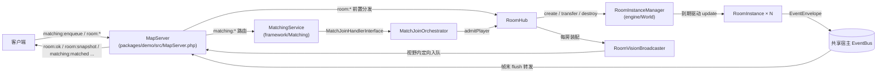

# Nythros 房间制玩法开发手册

> 面向读者：要用 Nythros 开发房间制玩法（匹配 → 建房 → 对局 → 结算 → 销毁）的服务端开发者。
> 读完你能：分清房间制与大地图模式的适用边界、看懂 `RoomInstance`/`RoomInstanceManager`/`MatchingService`/`RoomHub`
> 的职责分层、按 `room:*` / `matching:*` 真实帧名走通端到端流程、用 `verify-room.php` / `verify-matching.php`
> 做验收、用容量准入与 `drain` 管理房间进程生命周期，并规避常见反模式。
> 大地图模式见 [docs/mmorpg-mode.md](mmorpg-mode.md)，AOI 细节见 [docs/cell-guide.md](cell-guide.md)，
> 总体架构见 [docs/architecture.md](architecture.md)，性能数据见 [docs/performance.md](performance.md)。

## 1. 模式总览：房间制与大地图的分野

Nythros 支持两种玩法形态（`docs/mmorpg-mode.md` §1 有部署侧对比）。本文聚焦**进程内房间**：
房间是宿主 Map 进程里由 `RoomInstanceManager` 托管的短生命周期小世界，与大世界共享进程与事件总线。

| 维度 | 大地图（AOI 世界） | 进程内房间（本手册） |
|---|---|---|
| 生命周期 | 进程启动即存在，永续 | 匹配/请求创建，settle→close 销毁 |
| 成员进出 | 玩家常驻，AOI 视野随移动 | transfer 原子进出，`maxMembers` 准入 |
| 空间索引 | `GridAOI`（九宫格） | 每房间独立 AOI 工厂（demo 用 `GridAOI(10)`） |
| 典型玩法 | 主城/野外持续世界 | 守波 horde、匹配开房、棋牌/竞技场 |

**何时选房间制**：参与者固定成组、对局有明确开始/结束、状态随局销毁（结算后不留存）、
失败隔离要求高（一局的负载/异常不应影响其他对局）——选房间。
玩家自由聚集、世界状态长存——选大地图。

三条进程内铁律（源自 `RoomInstance` / `RoomInstanceManager` 的实现约束）：

1. **房间不跨进程**：房间表、归属表、房内 EM/AOI/ActorSystem 全在宿主 Map 进程内存里；
   匹配队列也是进程内的（`MatchingService`）。跨进程撮合/路由需自行借助 Redis 注册表指标扩展（见 §5）。
2. **一房一独立子系统**：每个房间有独立 `SimpleEntityManager`/`SimpleActorSystem`/`TickScheduler` 与
   自有 AOI 实例；`EventBus` 是宿主注入的共享总线（信封统一队列、宿主帧末统一 flush）。
3. **transfer 是受管成员唯一正规入口**：玩家经 `RoomInstanceManager::transfer` 进出并记入归属表；
   服务端直入实体（刷怪/掉落）走房内 `EM.add` 直入路径，不入归属表、不受 `maxMembers` 约束
   （`packages/engine/src/Contracts/RoomConfig.php` 类注释，ADR-024 §9 V4）。

## 2. 核心概念与组件地图

| 组件 | 路径 | 层 | 职责 |
|---|---|---|---|
| `RoomInstance` | `packages/engine/src/World/RoomInstance.php` | engine（`@internal`） | 房间聚合：自有 EM/AOI/ActorSystem/Scheduler；`join`/`leave`/`settle`/`close` 状态机与双向通知 |
| `RoomInstanceManager` | `packages/engine/src/World/RoomInstanceManager.php` | engine（`@internal`） | 房间表 + 归属表；`create`/`get`/`transfer`/`destroy`/`evictFromAny`；到期驱动 `tick`（预算截断 + 动态周期） |
| `RoomConfig` / `RoomState` | `packages/engine/src/Contracts/RoomConfig.php`、`RoomState.php` | engine 契约 | 房间配置值对象（`roomId`/`periodMs`/`maxMembers`/`aoiFactory`/`maxCatchUpTicks`）；生命周期枚举 `Created`→`Running`→`Settled`→`Closed` |
| `MatchingService` | `packages/framework/src/Matching/MatchingService.php` | framework | 匹配队列/撮合/开房编排；`registerCriteria`/`enqueue`/`cancel`/`tick`/`purgeOffline` |
| `MatchCriteria` / `MatchTicket` / `MatchJoinHandlerInterface` | 同目录 | framework | 撮合条件（`teamSize`/等级区间/开房参数）；排队票值对象；入房编排委托契约 |
| `RoomHub` | `packages/demo/src/RoomHub.php` | demo（参考实现·组装层） | `room:*` 路由编排中枢：建房、`admitPlayer` transfer 全链、刷怪/AoE、settle/close、归属与成员闸门 |
| `RoomVisionBroadcaster` | `packages/demo/src/RoomVisionBroadcaster.php` | demo（参考实现·组装层） | 房间视野广播器：定视野用房间自有 AOI，投递复用宿主 `MapServer::sendToEntity`（`VisionBroadcasterInterface` 门面） |
| `MatchJoinOrchestrator` | `packages/demo/src/MatchJoinOrchestrator.php` | demo（参考实现·组装层） | `MatchJoinHandlerInterface` 实现：撮合成功者走 `RoomHub::admitPlayer`，失败转 false 由撮合侧重排 |

分层铁律：framework 的 `MatchingService` 只依赖 `RoomManagerInterface` 契约与 `MatchJoinHandlerInterface`
委托，不感知 demo `RoomHub` 与 engine AOI 实现；所有组装（AOI 工厂闭包、Horde 配置、宿主总线）只发生在
demo 的装配点 `packages/demo/src/MapChannelFactory.php`（唯一组装点规则；你的游戏项目的组装层同理）。



## 3. 端到端流程

以下每一步的类、方法、帧名都来自源码（帧枚举见 `packages/demo/src/Protocol/FrameType.php`）。

### 3.1 匹配入房（ticket → criteria → orchestrate join）

1. 客户端发 `matching:enqueue{queueId, level}` → `MapServer::handleMatchingEnqueue`
   （`packages/demo/src/MapServer.php`）调 `MatchingService::enqueue($queueId, $uid, $entityId, $level, $now)`：
   条件未注册 / 等级越界（`MatchCriteria::admits`）/ 已在任意队列 → 回执 `matching:ok{op=enqueue, code=rejected}`；
   成功回执 `code=ok` 并**立即**触发 `MapServer::sweepMatching()`（低延迟开房）。
2. `MatchingService::tick($now)`（组装层另挂 1s 周期兜底定时器，见 `MapChannelFactory` 的
   `$timer->add(1.0, ... $map->sweepMatching())`）：逐队列按 FIFO 取满 `MatchCriteria::$teamSize` 个
   `MatchTicket`（`uid`/`entityId`/`level`/`queueId`/`enqueuedAt`）凑满即开房。
3. 开房 = `RoomManagerInterface::create(new RoomConfig(...))`（`roomId` 格式 `match-{queueId}-{seq}`，
   进程内唯一），随后逐候选者调 `MatchJoinHandlerInterface::joinRoom($roomId, $entityId)`——demo 实现是
   `MatchJoinOrchestrator::joinRoom` → `RoomHub::admitPlayer` 走 §3.3 的 transfer 全链。
   部分成功语义：失败者重排回队首（保留原入队时刻）；单票连续失败达
   `MAX_CONSECUTIVE_JOIN_FAILURES`（=3）即按毒票移出并告警。
4. 成员各收定向 `matching:matched{roomId, memberIds}`（`MapServer::sweepMatching` 逐 entityId 投递）
   以及各自入房的 `room:snapshot`。
5. 离线清理：断连路径调用 `MatchingService::purgeOffline($entityIds)` 摘除全部在队票；
   `cancel($uid)` 供 `matching:cancel` 主动取消（回执 `code=ok|not_queued|unavailable`）。

### 3.2 建房（直开路径）

`room:create{roomId}` → `RoomHub::handleCreate` → `RoomHub::createRoom`：
`RoomInstanceManager::create(new RoomConfig($roomId, $periodMs, $maxMembers, $aoiFactory))` 创建房间聚合，
并为每房装配独立 `CombatService`（以房间为 `WorldInterface` 门面）+ `RoomVisionBroadcaster`；
创建者 entityId 记入 `RoomHub` 归属表（settle/close 权限基准）。回执 `room:ok{op=create, roomId, count=0}`。
重复 roomId 抛 `InvalidArgumentException` → 定向 `error{code=400}`。

### 3.3 入房（transfer 约定路径，ADR-024 §4）

`room:join{roomId}` → `RoomHub::handleJoin` → `RoomHub::admitPlayer($entityId, $roomId)`：

1. 目标房存在性 + 状态预检（仅 `RoomState::Created`/`Running` 可入）；
2. 宿主世界侧先广播 `entity_leave`（G1：先广播后摘除），再摘除世界 AOI/EM 登记；
3. `RoomInstanceManager::transfer(null, $roomId, $entity, $actor)` 原子入房——归属表前置校验、
   join 失败（满员等）回滚世界登记；transfer 保留实体坐标；
4. 成功后 `MapServer::moveEntityToContainer($entityId, $room)` 把连接的容器维度标记到房间（ADR-024 §9 V6），
   此后该连接的指令路由与视野判定走房间 EM/AOI；并 `notifyTargetLeft` 通知世界怪放弃追击。

通知面：既有成员各收 `room:member_enter{id, roomId, position}` 信封，进入者收房间快照信封
（`RoomInstance::join` 发布，经共享总线在 `MapChannelFactory` 订阅转发为 `room:member_enter` /
`room:snapshot{roomId, memberIds[], positions[]}` 帧）；回执 `room:ok{op=join}`。

### 3.4 视野广播与对局帧

- 定视野：`RoomVisionBroadcaster::broadcastToVision($centerEntityId, $type, $payload)` 用房间自有 AOI
  `query` 视野内实体，逐连接经宿主 `sendToEntity` 入队；帧末 `flushOutbox` 统一批量下发
  （与宿主世界同构，见 §7 FrameMerger）。
- 房内刷怪：`room:spawn{roomId, count}`（成员闸门：非成员定向 403）→ `RoomHub::handleSpawn`——
  实体经房内 `EM.add` 直入（markMoved，首帧由房间 update 的 drainMoved 进 AOI 索引），
  不入归属表、不走 join 双向通知；`count` 限 1~500。
- 房内 AoE：`room:aoe{roomId, skillId, cx, cy, r}` → `CombatService::castSkillAoE`（形状查询/结算/
  合并广播全在房间内闭环）；伤害合并帧 `combat:aoe`，死亡合并帧 `entity_dead_batch`，掉落合并帧
  `drop:spawned_batch`。
- 移动等通用帧：进房后 `move` 自动按容器维度路由到房间上下文结算（verify-room 步骤 2.5 验证：
  join 后 move 无 `error{500}`、连接存活）；房内移动广播 `entity_moved` 跨容器投递到同房连接
  （verify-room 步骤 8）。

### 3.5 结算与销毁

- `room:settle{roomId}`（仅创建者；无主房任意玩家可接管）→ `RoomInstance::settle()`：
  `Running`→`Settled`，存活成员各收 `room:closed{roomId}` 信封（转发为 `room:closed` 帧）；停收成员。
- `room:close{roomId}` → `RoomHub::handleClose`：状态容错（`Created`/`Running` 先补 settle）→
  **销毁前把房内受管玩家回填宿主世界 EM/AOI** 并把连接容器维度回落 `null`（防「连接活着但无实体」僵尸）→
  `RoomInstance::close()` 清空成员与索引 → `RoomInstanceManager::destroy($roomId)` 移除房间并清归属表残留
  （否则离房玩家的归属残留会拒绝其后续跨房转移）→ 回执 `room:ok{op=close}`。
- 断连路径：玩家在房内断连时，宿主跨容器清理钩子调 `RoomInstanceManager::evictFromAny($entityId)`
  （`MapChannelFactory` 的 `setCrossContainerCleanup` 接线），房内其余成员收 `room:member_leave{id, roomId}`；
  创建者断连由 `RoomHub::handleCreatorDisconnected` 标记房间无主（不自动转移，防僵尸房）。

## 4. 最小可运行示例：从零写一个房间制玩法

### 4.1 启用装配

房间与匹配都是 env 开关（缺省关闭，存量部署零影响）：

```bash
# 房间（NYTHROS_ROOMS=1 同时启用 Horde 插件提供刷怪参数）：
NYTHROS_ROOMS=1 php bin/server start
# 房间 + 匹配（verify-matching 的启动口径，WSL 内用 setsid -f 防 SIGHUP）：
NYTHROS_ROOMS=1 NYTHROS_GAMEPLAY=1 NYTHROS_ACCOUNTS='1001=secret,1002=secret,1003=secret' \
  setsid -f php bin/server start
```

装配点全部在 `packages/demo/src/MapChannelFactory.php`：
`NYTHROS_ROOMS=1` 分支创建 `RoomInstanceManager`（注入宿主 `$world->getEventBus()`、预算
`ROOM_TICK_BUDGET_MS=9.0`、env `NYTHROS_ROOMS_MAX`/`NYTHROS_ROOMS_MAX_PERIOD_MS`）与 `RoomHub`；
`NYTHROS_GAMEPLAY=1` 分支创建 `MatchingService($roomManager, new MatchJoinOrchestrator($roomHub),
static fn (): GridAOI => new GridAOI(10))` 并 `registerCriteria(new MatchCriteria('duo-2', 2, 1, 999))`，
另挂 `$timer->add(0.015, ... $roomManager->tick(...))` 驱动房间帧。

### 4.2 脚手架生成内容件

```bash
php vendor/bin/make   # 打印 make:* 用法（入口 packages/framework/bin/make）

# 房内怪物 Actor 骨架（--kind=monster 继承 BaseMonster，钩子 onPatrol/onChase/onAttack/onDead/onDeath）：
php vendor/bin/make make:actor RoomGoblin --kind=monster --ns=Nythros\\Demo\\Game --out=packages/demo/src/Game
# 房间技能（写入 config/skills.php，供 room:aoe / skill:cast 校验）：
php vendor/bin/make make:skill FrostNova --out=packages/demo/config/skills.php
# 房间结算事件骨架：
php vendor/bin/make make:event RoomSettled --out=packages/demo/src/Game
```

可用命令共四类：`make:actor` / `make:skill` / `make:event` / `make:map`（`make:map` 面向大地图拓扑，
房间制一般用不到）。骨架带 TODO 注释，参照 `packages/framework/src/Combat/MonsterActor.php` 实现钩子。

### 4.3 写玩法逻辑（唯一组装点）

新增房间玩法逻辑时**只改你的游戏项目的组装层（参考 demo 的 `RoomHub` 同类编排）**，不要往 engine/framework 塞玩法：

1. 房间参数（tick 周期/成员上限/刷怪波次/AoE 半径上限）由 Horde 插件注册进 Container 的
   `HordeConfig` 提供（`NYTHROS_ROOMS` 分支解析后注入 `RoomHub` 构造器）；换玩法即换配置/插件。
2. 参考 `RoomHub::handleSpawn` 的直入路径：房内 `getEntityManager()->add($entity)` +
   `MonsterActor` 绑定房间门面 + `$room->getActorSystem()->add($monster)` + `$map->registerActor(...)`
   （AoE 命中结算经 ActorLookup 解析依赖此表）。
3. 结算逻辑挂在 settle 语义上：监听房间的 `room:closed` 信封（共享总线）或在编排层
   `room:settle` 路由后追加发奖——demo 未内置奖励管线，自行实现。

### 4.4 客户端最小帧序（对齐 verify-room）

```text
auth（gateway 18285 → Map 18081 直连 auth_ok）
room:create{roomId}            → room:ok{op=create}
room:join{roomId}              → room:snapshot{roomId, memberIds} + room:ok{op=join}
room:spawn{roomId, count}      → room:ok{op=spawn, count}
room:aoe{roomId, skillId, cx, cy, r} → combat:aoe + entity_dead_batch + drop:spawned_batch
room:settle{roomId}            → room:closed{roomId} + room:ok{op=settle}
room:close{roomId}             → room:ok{op=close}
```

匹配路径（对齐 verify-matching，3 客户端）：`matching:enqueue{queueId, level}` → 人满即双方收
`matching:matched{roomId, memberIds}` + 各自 `room:snapshot`（队列 `duo-2` 的 `teamSize=2`）。

### 4.5 跑验收

```bash
php packages/demo/bin/verify-room.php      # 房间生命周期 + AoE 批量管线（NYTHROS_ROOMS=1 服务）
php packages/demo/bin/verify-matching.php  # 匹配全流程（需 NYTHROS_GAMEPLAY=1 服务）
```

两脚本输出契约一致：逐项 `[verify] [PASS|FAIL]`，末行 `RESULT` 汇总。verify-room 覆盖 12 项：
登录、出生保护、建房、join、join 后 move、房内反作弊（`NYTHROS_ANTICHEAT=1` 时）、刷怪、
AoE 合并帧 1/1/1、settle、close、断连跨容器清理、双客户端容器路由。

## 5. 容量与生命周期

### 5.1 房间数准入（进程预算层）

`NYTHROS_ROOMS_MAX`（数字，0 = 不限缺省）→ `RoomInstanceManager::$maxRooms`：
`create()` 触顶抛 `OverflowException` → `RoomHub::handle` 捕获转定向 `error{code=507}`（busy，连接不断），
客户端可稍后重试或由路由层避开本进程；`MatchingService::tick` 捕获后整批重新入队并终止本队列本拍撮合。
长期出路是把匹配路由到其他进程——registry 心跳指标已暴露 `rooms` / `roomsDeferred`
（`MapChannelFactory` 的 `setRoomMetricsProvider` 接线）。

### 5.2 连接容量准入（maxCapacity）

`NYTHROS_MAP_CAPACITY`（数字，0 = 不限缺省）→ 注册 meta 携带 `maxCapacity`：
gateway `selectChannel` 跳过满员实例 + Map 侧 auth 硬守卫（并发窗口兜底）。房间托管进程同样受益：
满员实例不再被分配新会话，但**存量房间对局不受影响**（drain/容量只挡新连接，不断旧连接）。

### 5.3 drain 生命周期（GM 命令）

```text
客户端 → gm:exec{command: 'drain'} → gm:result{code: ok}
```

实现链：`packages/framework/src/Gm/Command/DrainCommand.php` → `GmDrainHandlerInterface`（由 `MapServer`
实现）——标记本实例 `status=draining`（registry 心跳 meta，目录停止路由新会话）+ 本地守卫激活（新 auth
拒绝）；存量连接与在跑房间不受影响，等对局自然 settle/close 后即可停进程。GM 需白名单：
启动加 `NYTHROS_GM_UIDS=1001`。端到端验收见 `packages/demo/bin/verify-scale.php`（步骤 1/2）。

### 5.4 动态扩容发现

房间进程通常与大地图共用 map worker 拓扑；容量不足时直接拉起新频道 worker，registry 自动注册、
gateway 即时发现（`verify-scale.php` 步骤 3 的真实命令）：

```bash
nohup php packages/demo/bin/run-worker.php --service=map --mapId=map-1 --channelId=ch-3 --port=18089 \
  > /tmp/nythros-ch3.log 2>&1 &
```

注意：匹配队列是进程内的，新进程不会自动接管旧进程排队中的票——扩容后新撮合自然落在低载进程，
存量排队需等待原进程消化或自行实现跨进程队列（待验证：当前无内置方案）。

## 6. 常见变体

### 6.1 回合制棋牌

- 节奏：`RoomConfig::$periodMs` 可设大（棋牌不需要 15~50ms 帧；`MatchCriteria::$roomPeriodMs` 缺省 50、
  demo 匹配队列透传同值）。回合推进优先用房间自有调度器（`RoomInstance::getScheduler()`，帧任务），
  而非每房间再挂宿主定时器。
- 视野：棋牌全员互见——AOI 工厂换成全量广播型（`RoomInstance::getType()` 由 AOI 实现推导：
  `UniversalAOI` 即 `WorldType::FULL_BROADCAST`，工厂须包裹房间自有 EM；`GridAOI` 等零参工厂写法见
  `packages/engine/src/Contracts/RoomConfig.php` 的 aoiFactory 契约注释）。
- 生命周期：开局才 join（`Created` 首次 join 自动激活 `Running`），一局结束 `settle` → 发奖 → `close`；
  中途退出用断连清理兜底（§3.5），不需要专用「离房」请求帧（demo 的 `RoomHub` 未提供 room:leave 路由，
  成员离开只发生在 close 回填与断连 evict 两条路径）。

### 6.2 MOBA 类分组

`MatchingService` 是「单队列 FIFO 凑满即开房」语义（`MatchCriteria` 类注释：同队列准入区间相同，
不做事后排序）。MOBA 的阵营分配、段位加权、预组队保留等需求需在组装层扩展，例如：注册多个队列
（`registerCriteria` 后注册覆盖先注册）按分段分流，或在自定义 `MatchJoinHandlerInterface` 实现里
做入房前分组。直接改 framework 撮合语义会破坏分层铁律（待验证：framework 侧无内置阵营支持）。

### 6.3 副本开荒（部署型全量广播 World）

与进程内房间并行的另一条路径是**部署型副本池**：`packages/demo/config/deploy.yaml` 的 `dungeon` 单元
（`dungeon-A#pool-1`，`worldType: full`，端口 18084）——每个副本实例是独立进程 + 独立全量广播 World
（`UniversalAOI`，无空间索引），社交层按 `mapId` 过滤副本、`minPlayerCount` 选进程池
（`packages/framework/src/Social/SocialService.php` 的 `selectChannel`/`minPlayerCount`）。
适合长周期开荒副本（对局生命周期跨进程重启、需要独立扩缩容）；短生命周期高频开房仍推荐进程内
`RoomInstance`。注意 `packages/demo/bin/verify-phase5.php` 的验收矩阵是社交层（登录/进图/聊天/组队等），
不含副本模式专项验收项——副本池链路目前没有专门 E2E 脚本（待验证）。

## 7. 性能与注意点

### 7.1 一频道一进程一 World 下的房间开销

房间寄生在宿主 Map 进程里：所有房间共享进程的单核预算与出站管道。`MapChannelFactory` 的驱动参数：

- 宿主每 `ROOM_HOST_TICK_SECONDS = 0.015`s 调一次 `RoomInstanceManager::tick`，单次预算
  `ROOM_TICK_BUDGET_MS = 9.0`ms；预算耗尽则剩余到期房间顺延（deferred）。
- 预算压力自调：连续被顺延 ≥2 次的房间把自身周期 ×1.5 膨胀（上限 `maxDynamicPeriodMs`，
  env `NYTHROS_ROOMS_MAX_PERIOD_MS`，缺省 50ms、下限 15ms）；本轮零顺延则全部膨胀房间按 ÷1.25 回落
  向配置周期。落后超过 `RoomConfig::$maxCatchUpTicks`（缺省 4）个周期则跳帧对齐（防死亡螺旋）。
- 房间无聚格降频（那是大地图移动广播的机制）；房内的「降载」即上述动态周期膨胀——表现为
  房间 tick 频率下降，房间内移动/技能广播粒度随之变粗，客户端插值需容忍（见 docs/state-sync.md）。

实测参考（`docs/performance.md` §6.2，WSL2 开发机，绝对值以目标硬件复测为准）：
`benchmarks/stress-rooms.php --rooms=15 --seconds=25`（15 房 × 6 bot，30Hz 房间 tick + 周期 spawn/AoE）
带宽/客户端 6204 B/s、帧率 128.8 f/s、RSS ≈37MB 恒定、无持续顺延——预算层的降档信号需 30+ 活跃房间
才能观测。

### 7.2 FrameMerger 批量

房内广播与宿主世界同构：`RoomVisionBroadcaster::broadcastToVision` 一次调用 = 视野内每个连接各入队一帧，
帧末宿主 `flushOutbox` 统一批量下发（FrameMerger 合并）。玩法侧要坚持**合并帧语义**而不是逐目标发帧：
`combat:aoe`（一次施法恰好一帧）、`drop:spawned_batch`（一波掉落恰好一帧）、`entity_dead_batch`
（并行等长列表）——verify-room 步骤 4 断言 200 杀窗口内三类合并帧各恰好 1 帧、逐目标
`combat:hit`/`entity_dead` 为 0。自定义玩法广播应比照此口径攒批。

### 7.3 其他注意点

- **成员闸门的边界**：死亡玩家的实体不摘除房内 EM，仍算成员（成员资格随实体登记生死，不随 hp 归零）；
  死亡后的 spawn/aoe 由各自后续校验另行拦截。
- **房间 id 稳定复用**：verify-room 的幂等前置（撞残留房先 `room:close` 再重建）依赖
  `handleClose` 的状态容错——自己的重连/重试逻辑也应这样写，不要假设 roomId 永远干净。
- **观测**：`RoomInstanceManager::lastDeferred()` / `periodMap()` 暴露顺延与动态周期；
  `PerfProbe` 记录 `room.frame_ms` / `room.envelope_published`（`RoomInstance::update` 内埋点）。

## 8. 反模式清单

1. **往 framework/engine 塞玩法**：组装（AOI 工厂、Horde 配置、编排路由）只允许发生在你的项目的组装层
   （demo 的铁律即唯一组装点 `MapChannelFactory`）；framework 的 `MatchingService` 只依赖契约。
2. **先摘除后广播**：入房必须先向世界视野邻居广播 `entity_leave` 再摘世界登记（G1 时序，
   `RoomHub::admitPlayer`）；反过来摘除后世界 AOI/EM 已无此实体，无从补发。
3. **transfer 成功前触碰容器维度**：`moveEntityToContainer` 必须在 `transfer` 成功之后
   （回滚路径容器零触碰）。
4. **close 前不回填受管玩家**：直接 `destroy` 会让房内玩家变成「连接活着但无实体」僵尸；
   必须先回填宿主世界 EM/AOI 并回落容器维度（`RoomHub::handleClose`）。
5. **destroy 不清归属残留**：绕过 `RoomInstanceManager::destroy` 手动摘房间会留下归属表脏记录，
   拒绝玩家后续跨房转移。
6. **把 `maxMembers` 当全量容量**：它只约束 join/transfer 的受管成员；直入实体（刷怪/掉落）不限，
   规模靠业务配额自控（如 `room:spawn` 的 count 1~500 上限）。
7. **撮合失败不重排 / 不设毒票上限**：`MatchingService` 的部分成功语义依赖失败重排（回队首保留原时刻）
   与 `MAX_CONSECUTIVE_JOIN_FAILURES` 毒票移除；自建撮合缺了这两条会空转开半空房或队列耗尽。
8. **无视 `OverflowException`**：`create` 触顶继续塞房会把预算压力转成全员动态降频；应转 507 busy /
   整批重排 / 路由他处。
9. **无主房没人管**：创建者断连必须标记无主（`RoomHub::handleCreatorDisconnected`），
   否则房间变僵尸泄漏；也不要自动转移房主（继任者选择是策略问题，demo 裁决为任意玩家可接管）。
10. **逐目标洪泛帧**：AoE/死亡/掉落坚持合并帧；每杀一条 `combat:hit` 在 200 杀场景就是 200 帧/窗口的扇出。
11. **匹配票不接断连清理**：排队玩家断连后票留在队列里会被凑进新房；断连路径必须调
    `MatchingService::purgeOffline`。
12. **每房间自挂宿主定时器**：房间节奏统一走 `RoomInstanceManager` 到期驱动 + 房间自有
    `TickScheduler`；绕开管理器直挂 `Timer` 会绕过预算截断与动态周期。
